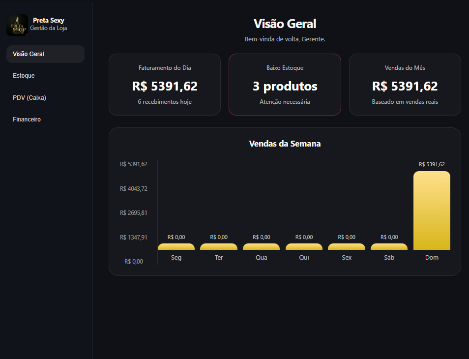
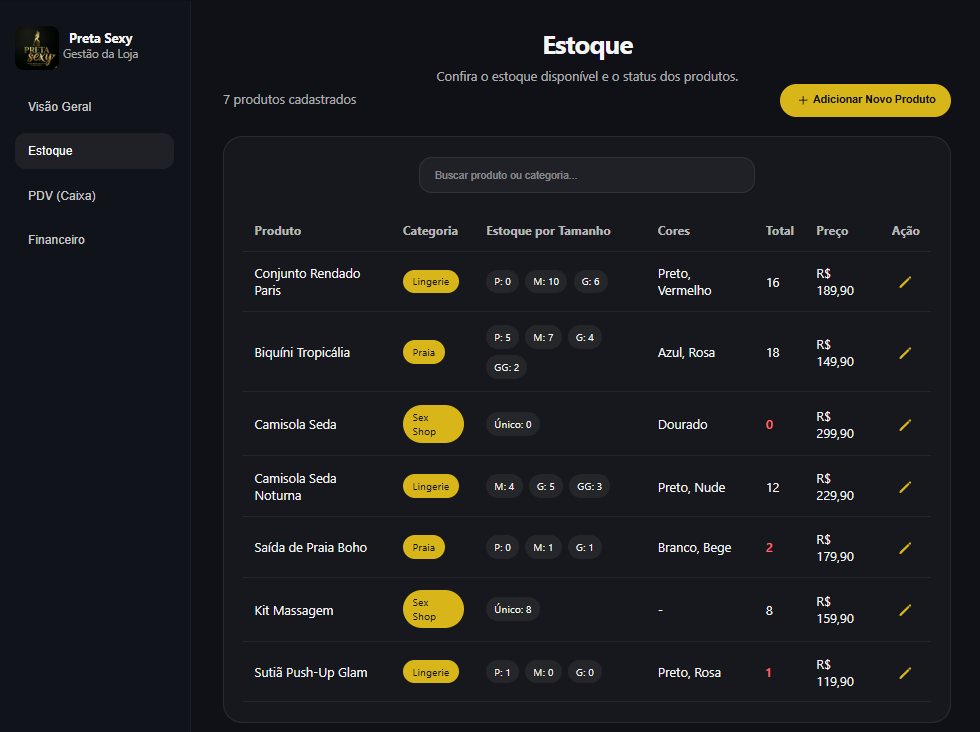
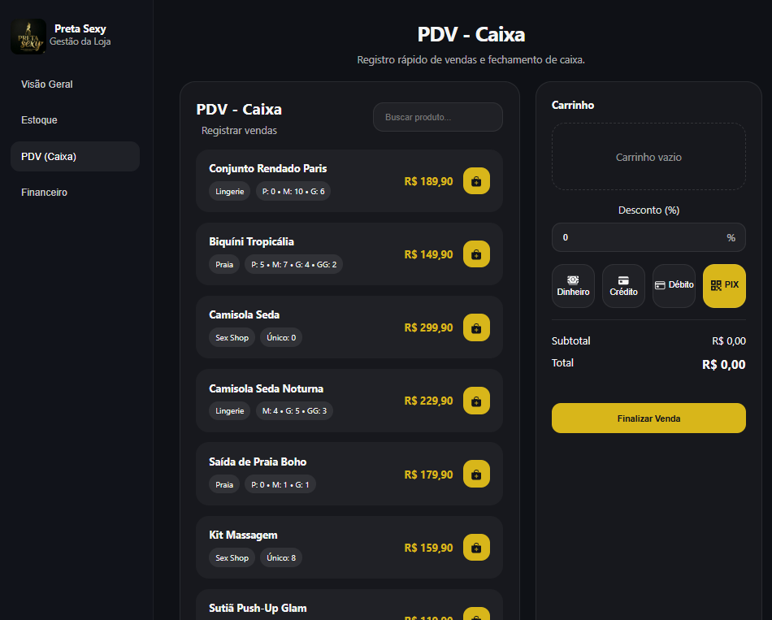

# Preta Sexy - Gestão da Loja ✨

Um app desktop para gestão de loja de roupas, criado com React, TypeScript e Tauri. Ideal para controlar estoque, fazer vendas no PDV, acompanhar finanças e gerar relatórios rápidos.

---

## 🚀 Visão geral

- Gerencie produtos por tamanho e cor
- Faça vendas com carrinho inteligente e recibo
- Aplique descontos e veja subtotal / total atualizados
- Visualize vendas semanais em gráfico
- Salve dados localmente na máquina

---

## 📸 Capturas de tela


*Dashboard de vendas e métricas.*


*Gestão de produtos e status de estoque.*


*Ponto de venda com seleção de tamanhos e carrinho.*

---

## ✨ Funcionalidades principais

- **Dashboard** com faturamento, baixo estoque e gráfico de vendas
- **Estoque** com produto, categoria, cores, total e variações de tamanho
- **PDV** com seleção de tamanho, quantidade e desconto percentual
- **Recebimento** com comprovante de venda para impressão
- **Histórico financeiro** de receitas e despesas
- **Persistência local** usando `localStorage` para manter dados entre sessões

---

## 🛠️ Tecnologias usadas

- React 18
- TypeScript
- Vite
- Tauri
- Ionicons
- CSS personalizado

---

## ⚙️ Pré-requisitos

- Node.js 18+
- npm ou yarn
- Rust toolchain (para usar Tauri): [rustup.rs](https://rustup.rs/)

---

## 🚀 Como executar

### 1) Rodar em modo web

```bash
npm install
npm run dev
```

Acesse: `http://localhost:5174`

### 2) Rodar em modo desktop

```bash
npm run tauri:dev
```

Isso abre o app em uma janela nativa com hot-reload.

---

## 📦 Build

### Web

```bash
npm run build
```

Arquivos gerados em `dist/`

### Desktop

```bash
npm run tauri:build
```

Executável gerado em `src-tauri/target/release/`

---

## 📁 Estrutura do projeto

```text
loja-roupa/
├── assets/                # Imagens, ícones e screenshots
├── public/                # Arquivos estáticos
├── src/
│   ├── components/        # Componentes React
│   │   └── Dashboard.tsx   # Tela principal do app
│   ├── App.tsx
│   ├── main.tsx
│   └── ...
├── src-tauri/             # Configuração e build do Tauri
│   ├── src/               # Código Rust (se usado)
│   ├── tauri.conf.json    # Config de janela e bundle
│   └── ...
├── package.json
├── tsconfig.json
├── vite.config.ts
└── README.md
```

---

## 💡 Dicas rápidas

- Use o botão de editar produto para atualizar estoque, cores e preço
- No PDV, selecione o tamanho certo antes de adicionar ao carrinho
- O desconto aparece no resumo como valor subtraído do subtotal
- As vendas só são contabilizadas após finalizar e fechar o comprovante

---

## 📜 Scripts úteis

- `npm run dev` — rodar o app no navegador
- `npm run build` — gerar build de produção
- `npm run preview` — pré-visualizar o build
- `npm run lint` — verificar código com ESLint
- `npm run tauri:dev` — rodar app Tauri em modo dev
- `npm run tauri:build` — gerar o executável desktop

---

## 🤝 Contribuição

1. Faça um fork
2. Crie uma branch: `git checkout -b feature/nova-feature`
3. Commit com mensagem clara
4. Dê push e abra um Pull Request

---

## 🔒 Licença

Este projeto é privado e não possui licença pública.
